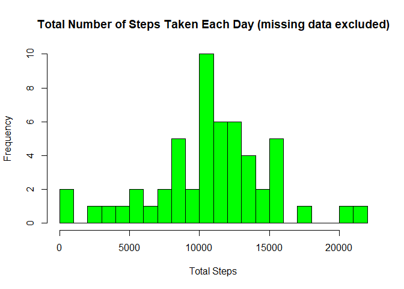
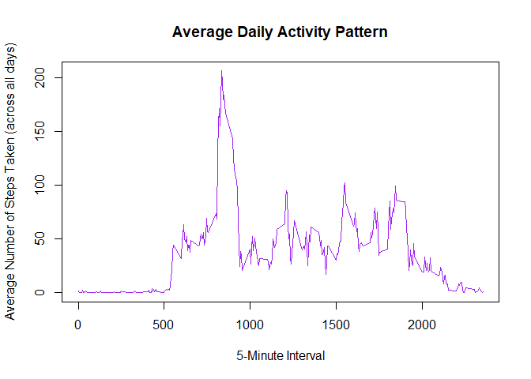
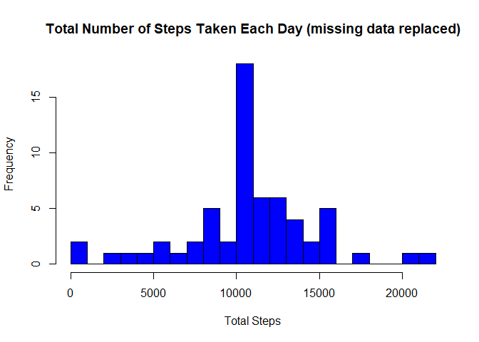
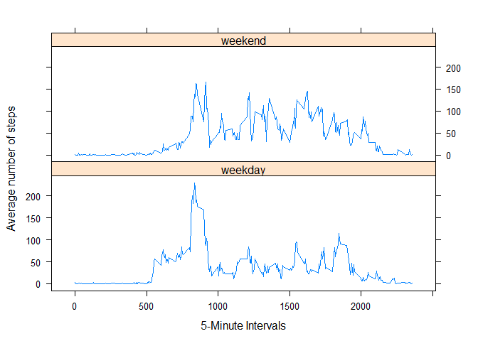

## 1. Loading and preprocessing the data
**1a. Loading the data**

```r
data<- read.csv("activity.csv")
```


**1b. Processing/transforming the data (if necessary) into a format suitable for analysis**

- Transforming dates and subsetting dataset to be free of missing values

```r
data$date<- as.Date(data$date)
dfna<-subset(data, !is.na(data$steps))
```

## 2. What is mean total number of steps taken per day?
**2a. Calculate the total number of steps taken per day**

```r
totalstepspd<- tapply(data$steps, data$date, sum)
```


**2b. Make a histogram of the total number of steps taken each day**

```r
hist(x = totalstepspd,
     col = "green",
     breaks = 20,
     xlab = "Total Steps",
     ylab = "Frequency",
     main = "Total Number of Steps Taken Each Day (missing data excluded)")
```

<!-- -->


**2c.Calculate and report the mean and median of the total number of steps taken per day**

```r
options(scipen=999)
meanstepspd<- mean(totalstepspd, na.rm = TRUE)
meanstep4dig<-round(meanstepspd, digits=4)
medianstepspd<- median(totalstepspd, na.rm = TRUE)
medianstep4dig<-round(medianstepspd, digits=4)
```
- The mean total number of steps taken per day are 10766.1887 while the median total number of steps taken per day are 10765.

## 3. What is the average daily activity pattern?
**3a. Make a time series plot of the 5-minute interval and the average number of steps taken, averaged across all days**

```r
stepintervals<- tapply(data$steps, data$interval, mean, na.rm = TRUE)
plot(as.numeric(names(stepintervals)),
     stepintervals,
     xlab = "5-Minute Interval",
     ylab = "Average Number of Steps Taken (across all days)",
     main = "Average Daily Activity Pattern",
     type = "l",
     col = "purple")
```

<!-- -->


**3b. Which 5-minute interval, on average across all the days in the dataset, contains the maximum number of steps?**

```r
maxsteps<- sort(stepintervals,decreasing = TRUE)[1]
maxsteps4dig<- round(maxsteps, digits = 4)
maxinterval<-names(sort(stepintervals,decreasing = TRUE))[1]
```
- The maximum number of steps of 206.1698 occurs in interval 835.


## 4. Imputing missing values
**4a. Calculate and report the total number of missing values in the dataset**

```r
missingvals<- sum(is.na(data$steps))
```
- The total number of missing values in the dataset is 2304.


**4b. Devise a strategy for filling in all of the missing values in the dataset**

- Strategy devised and deployed for filling in all missing values in the data set is to fill/replace each missing value with the mean number of steps from its given 5-minute interval.


**4c.Create a new dataset that is equal to the original dataset but with the missing data filled in.**

```r
dfna<-subset(data, !is.na(data$steps))
datafill <- data
newdata <- is.na(datafill$steps)
intervalmean <- tapply(dfna$steps, dfna$interval, mean, na.rm=TRUE, simplify=T)
datafill$steps[newdata] <- intervalmean[as.character(datafill$interval[newdata])]
```


**4d. Make a histogram of the total number of steps taken each day and calculate and report the mean and median total number of steps taken per day** 

```r
newtotalsteps <- tapply(datafill$steps, datafill$date, sum, na.rm=TRUE, simplify=T)

hist(x=newtotalsteps,
     col = "blue",
     breaks = 20,
     xlab = "Total Steps",
     ylab = "Frequency",
     main = "Total Number of Steps Taken Each Day (missing data replaced)")
```

<!-- -->

```r
options(scipen=999)
meanfill<- mean(newtotalsteps, na.rm = TRUE)
meanfill4dig<-round(meanfill, digits=4)
medianfill<- median(newtotalsteps, na.rm = TRUE)
medianfill4dig<-round(medianfill, digits=4)
```
-  The imputed mean total number of steps taken per day are 10766.1887 while the imputed median total number of steps taken per day are 10766.1887.  
-  The imputed mean is the same as the mean value estimated in the first part of the assignment, whereas the imputed median has increased from its earlier estimated value.  
-  The impact of imputing the data has resulted in the same value being determined for both the imputed mean and the imputed median.


## 5. Are there differences in activity patterns between weekdays and weekends?
**5a. Create a new factor variable in the dataset with two levels - "weekday" and "weekend" indicating whether a given date is a weekday or weekend day**

```r
weekday <- function(d) {
    factorvariable <- weekdays(d)
    ifelse (factorvariable == "Saturday" | factorvariable == "Sunday", "weekend", "weekday")
}

weekdata <- sapply(datafill$date, weekday)
datafill$weekclass <- as.factor(weekdata)
```


**5b. Make a panel plot containing a time series plot of the 5-minute interval and the average number of steps taken, averaged across all weekday days or weekend days**

```r
weekset <- aggregate(steps ~ weekclass+interval, data=datafill, FUN=mean)

library(lattice)
xyplot(steps ~ interval | factor(weekclass),
       data=weekset,
       layout = c(1, 2),
       xlab="5-Minute Intervals",
       ylab="Average number of steps",
       type="l",
       lty=1
       )
```

<!-- -->

- Based on the panel plot, it appears that there are differences in activity patterns between weekdays and weekends.
